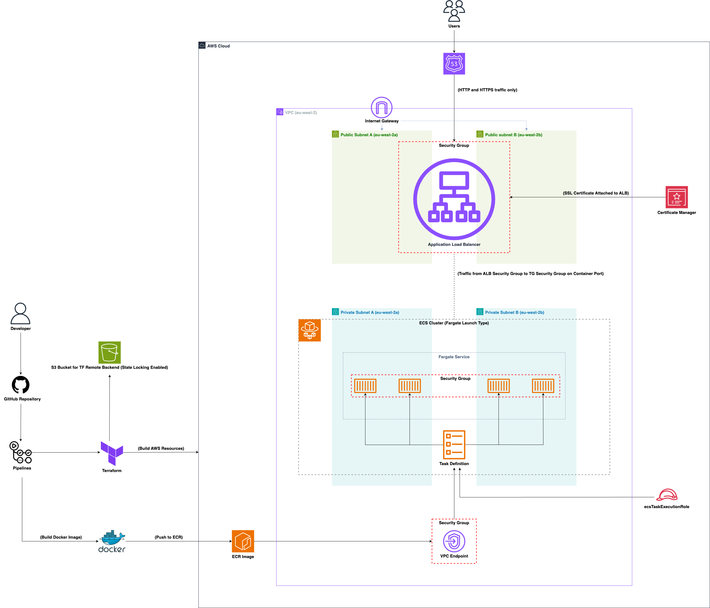
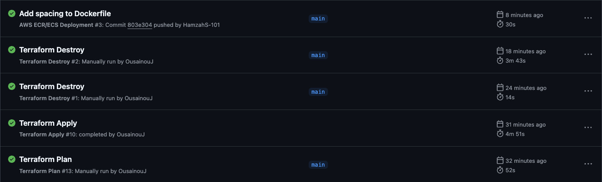

# ECS Project

## Table of Contents

- [Project Summary](#project-summary)
- [App Overview](#app-overview)
- [Architecture Overview](#architecture-overview)
- [App Containerisation](#app-containerisation)
- [Terraform Infrastructure](#terraform-infrastructure)
- [CI/CD Deployment Workflows](#cicd-deployment-workflows)

## Project Summary

This project sets up and deploys a containerised web application on AWS using Terraform. The infrastructure is split into modules to keep the code organised, and GitHub Actions workflows are used to automate builds, testing, and deployments.

All resources are defined in code so they can be created, updated, or destroyed in a consistent way.

## App Overview

The AWS Threat Model application is designed to help teams identify, model, and assess potential security threats in cloud-based architectures deployed on AWS. It provides a structured framework for visualizing AWS infrastructure components, mapping out threat surfaces, and proposing effective mitigation strategies.

By empowering development and security teams to proactively recognize vulnerabilities early in the design process, the app supports better planning, stronger architectural decisions, and improved system hardening before deployment.

## Architecture Overview

The infrastructure is deployed on **AWS** using a modular Terraform setup and follows a typical modern containerised architecture:

- **VPC** spans multiple Availability Zones in the `eu-west-2` region, with both public and private subnets.
- **Application Load Balancer (ALB)** is deployed in the public subnets and is responsible for routing traffic to the ECS service.
- **SSL Certificate** is provisioned using AWS Certificate Manager and attached to the ALB to support HTTPS.
- **ECS Cluster (Fargate)** runs in private subnets and hosts the containerised web application.
- **Task Definitions** define how containers are run, including port, CPU, and memory settings.
- **ECR (Elastic Container Registry)** stores the Docker image that's built and pushed via the CI/CD pipeline.
- **VPC Endpoints** are configured for private access to services like ECR and CloudWatch Logs from ECS tasks.
- **Security Groups** tightly control traffic between the ALB, ECS tasks, and VPC endpoints.
- **Terraform Backend** uses an S3 bucket for state storage with locking enabled.

All components are provisioned and updated through Terraform, and workflows are used to automate the deployment process.

## App Containerisation

The static web application is containerised using a lightweight **Nginx Alpine** image. The container serves the HTML content using Nginx on port 80 and is built using the [Dockerfile](Dockerfile) located at the root of the project.

Following a **Trivy vulnerability scan** in the CI/CD workflow, adjustments were made to the container image — for example, the base image version was updated to address known security issues.

## Terraform Infrastructure

The infrastructure is defined using **Terraform**, with a modular structure to keep the code organised and reusable. Each major component of the architecture is isolated into its own module, including:

- `vpc/`
- `alb/`
- `ecs/`
- `route53/`

All input values are managed through a central `terraform.tfvars` file, and variables are declared cleanly in the root `variables.tf` to ensure consistency across environments.

To maintain a consistent and safe deployment state, Terraform uses **remote state storage** with an **S3 bucket**, and **state locking** is enabled to prevent concurrent modifications during deployment operations.

You can view the infrastructure code in the [Terraform directory](terraform/).

## CI/CD Deployment Workflows

The deployment process for the **Team Echo App** is fully automated using **GitHub Actions**. Each workflow is triggered based on specific changes to the codebase, ensuring efficient and relevant builds and deployments. All workflows authenticate with AWS using **credentials stored securely in GitHub Secrets**.

---

### [Docker Image Build, Trivy Scan & Push](.github/workflows/docker-image.yml)

- Triggered on **push to the `main` branch** when there are changes to either the `Dockerfile` or the `app/` directory
- Builds the Docker image  
- Runs **Trivy** to scan for critical and high-severity vulnerabilities  
- Pushes the image to **Amazon ECR**

---

### [Terraform Plan](.github/workflows/tf-plan.yml)

- Triggered on **push to the `main` branch** when there are changes to the `terraform/` directory
- Downloads the `.tfvars` file from an **S3 bucket**
- Verifies the file exists in the `terraform/` directory
- Sets up **Terraform**
- Installs and runs **TFLint** for syntax and style checking
- Runs **Checkov** to detect security misconfigurations
- Performs `terraform fmt` and `terraform validate` to ensure consistent formatting and valid configuration

---

### [Terraform Apply](.github/workflows/tf-apply.yml)

- Runs **only if** the Terraform Plan workflow completes successfully
- Sets up and initialises Terraform
- Applies the previously generated Terraform plan automatically

---

### [Terraform Destroy](.github/workflows/tf-destroy.yml)

- Manually triggered on demand
- Destroys all Terraform-managed infrastructure

The image below shows a successful run of each workflow, confirming that the CI/CD pipelines are functioning as expected.

